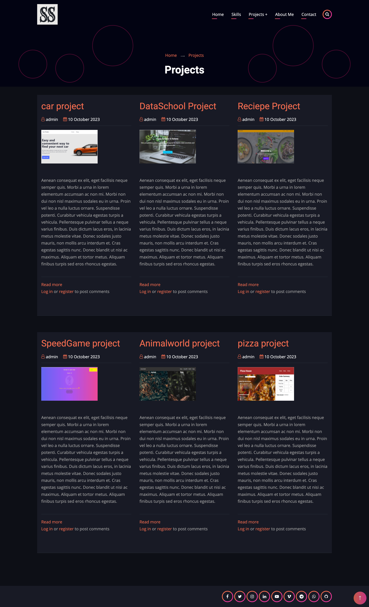
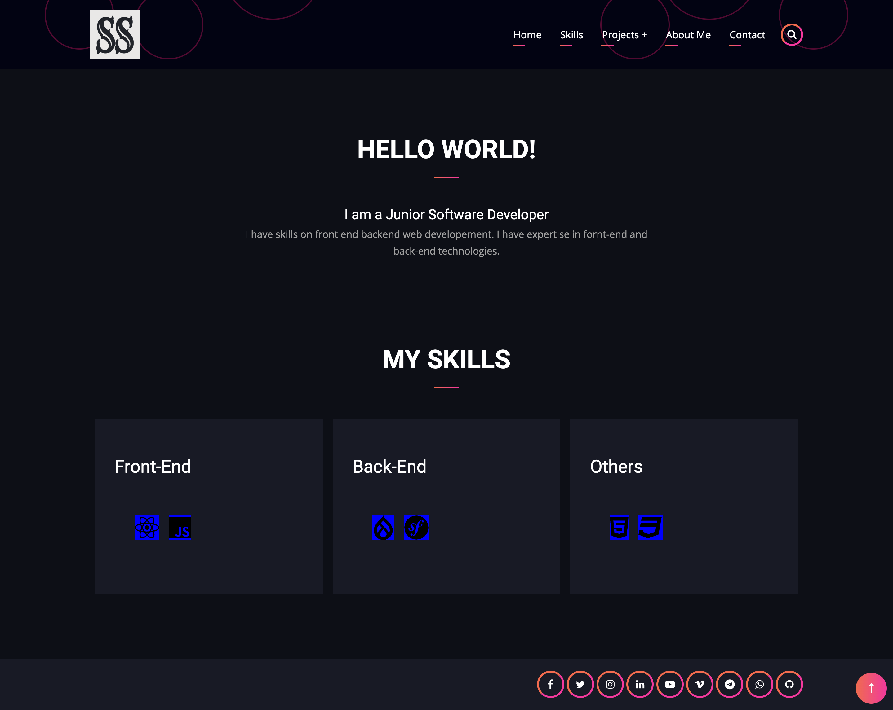
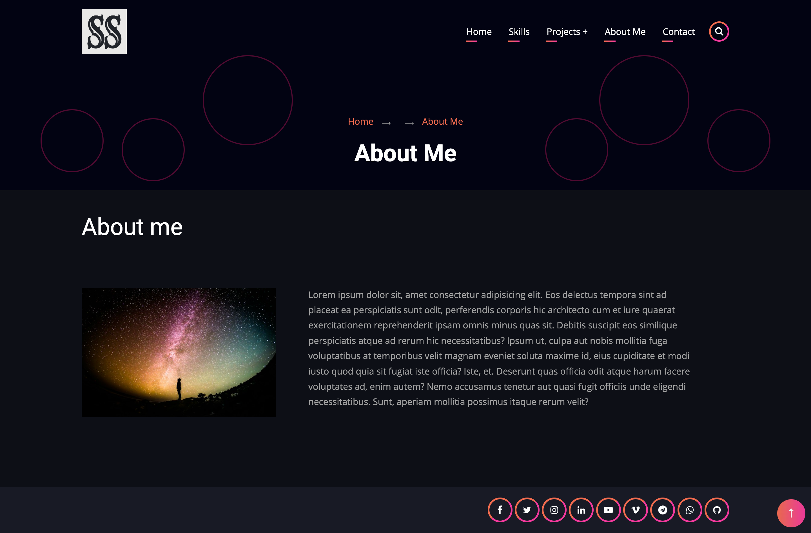
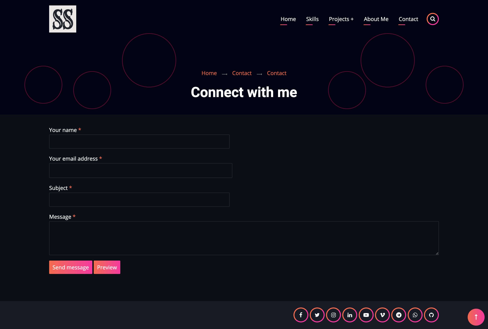

# Portfolio with Drupal 10 and contrib theme

This is a portfolio site built with Drupal 10 and a contrib theme.

## Technologies used

Built with:

- Drupal 10
- Lando
- Docker
- MySQL

## Setup and usage

In the project directory, you can run:

### `lando start`

this project uses lando to run the drupal 10 site. You will need to install lando and run lando start to get the site running. You can find more information about lando here: [https://docs.lando.dev/basics/] (https://docs.lando.dev/basics/)

### `lando info`

You can run lando info to get the url for the site. You can run in the browser to see the site and login to the drupal admin for development.

## Screenshot

## Authors and acknowledgment

SANI SAHA

- GitHub @sanisaha
- [LinkedIn](https://www.linkedin.com/in/sani-saha-28978aa4/)
